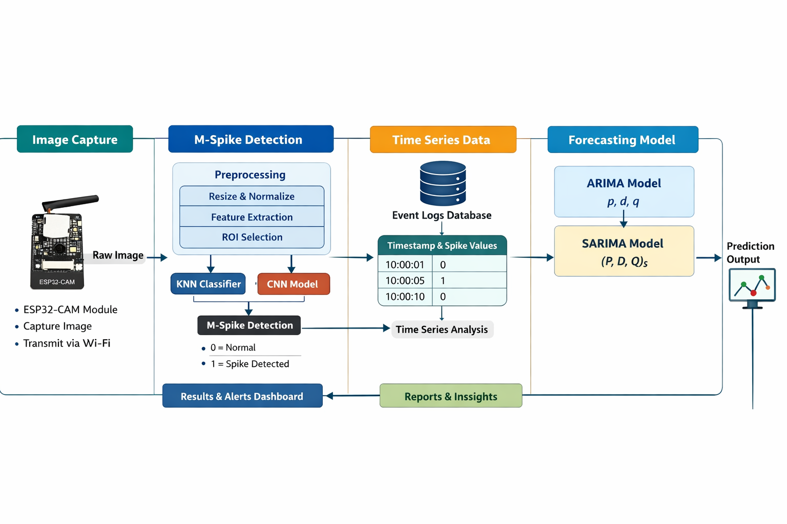
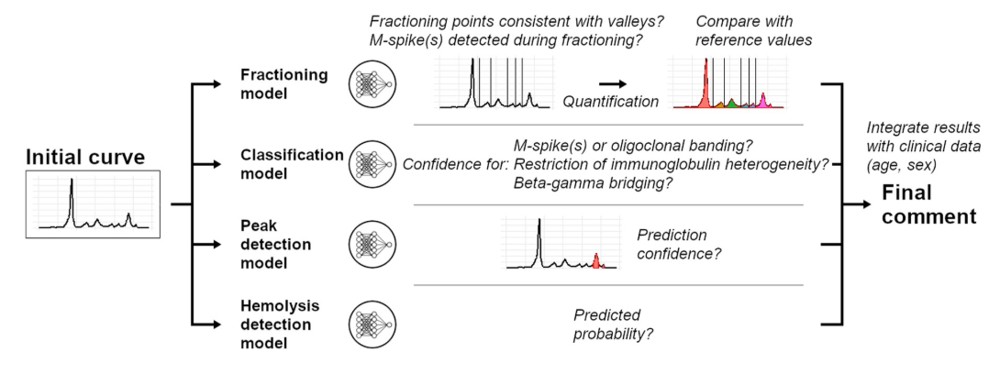

##Low-Cost Protein Electrophoresis Analyzer (LC-PEA)

This full-stack web application enables automated analysis of electrophoresis gel images to detect M-spikes, quantify protein band intensity, and support future prediction of disease progression using time-series models.

##Project Abstract

Serum protein electrophoresis (SPE) is widely used for diagnosing monoclonal gammopathies, immunodeficiencies, and chronic inflammatory conditions. However, traditional systems are expensive and require centralized laboratory infrastructure.

The LC-PEA system addresses this limitation by providing a low-cost, portable, and AI-driven solution. It integrates electrophoresis hardware, edge-based image acquisition (ESP32-CAM), machine learning models, and time-series forecasting to enable automated diagnostics.

The platform performs image preprocessing, band detection, M-spike classification using KNN (currently implemented), and densitometry. Future enhancements include CNN-based classification and ARIMA/SARIMA-based disease progression prediction.

##System Architecture

                                                                ##Overall Architecture (DFD)

This architecture represents the complete pipeline:

Image acquisition (ESP32-CAM – pending integration)
Image preprocessing and feature extraction
M-spike detection using machine learning
Data storage and analysis
Time-series forecasting (planned)
##Visualization and reporting

M-Spike Detection and Electrophoresis Workflow

##This workflow includes:

Gel electrophoresis band formation
Image capture and processing
Band detection and intensity analysis
M-spike identification and classification
Current Progress
Completed
Image preprocessing pipeline:
Noise removal
Contrast enhancement
ROI (band/lane) extraction
M-spike detection using KNN classifier
Band intensity calculation (digital densitometry)
Backend (FastAPI) and frontend (React) integration
User authentication and report storage system
In Progress
Time-series analysis using ARIMA and SARIMA
Hardware setup and ESP32-CAM integration
CNN-based model for improved classification
##Features
User authentication with JWT
Upload and process electrophoresis gel images
Automated preprocessing pipeline:
Image enhancement and denoising
Band extraction and segmentation
M-spike detection using KNN classifier
Digital densitometry for band intensity measurement
Report history tracking
Visualization dashboard
Time-series forecasting module (in progress)
##End-to-End Workflow
Stage 1: System Setup (Hardware – In Progress)
Electrophoresis setup using agarose gel and electrodes
Controlled lighting environment
ESP32-CAM integration (pending completion)

Output: Stable imaging system (partially completed)

Stage 2: Data Acquisition
Capture gel images (currently manual)
Planned: automated capture via ESP32-CAM

Output: Raw electrophoresis images

Stage 3: Image Processing
Noise filtering
Contrast enhancement
Band/ROI extraction

Output: Clean band patterns

Stage 4: Pattern Analysis
KNN-based classification
Detection:
0 = Normal
1 = M-spike detected

Output: Identification of abnormal protein bands

Stage 5: Quantification and Storage
Band intensity measurement
M-spike estimation
Data storage with timestamps

Output: Structured analytical dataset

Stage 6: Time-Series Analysis (In Progress)
Trend analysis of M-spike values
Planned models:
ARIMA
SARIMA

Output: Predictive insights

Stage 7: System Integration (In Progress)
Integration of hardware, ML, and analytics pipeline

Output: End-to-end automated diagnostic system

##Project Structure
DNA/
├── backend/               # FastAPI backend
│   ├── app/               # Application code
│   │   ├── main.py
│   │   ├── auth.py
│   │   ├── database.py
│   │   ├── electrophoresis_utils.py   # Image processing utilities
│   │   └── models.py
│   ├── requirements.txt
│   └── run.py
│
├── frontend/              # React frontend
│   ├── src/
│   │   ├── components/
│   │   ├── App.js
│   │   └── index.js
│   └── package.json
│
└── assets/
    ├── architecture.png
    └── mspike_workflow.png
Setup and Installation
Backend
cd backend
pip install -r requirements.txt
python run.py

Backend runs at: http://localhost:8000

Frontend
cd frontend
npm install
npm start

Frontend runs at: http://localhost:3000

Usage
Register or log in
Navigate to the "Analyze" section
Upload electrophoresis gel images
Run M-spike detection
View band intensity and classification results
Access report history

##Technologies Used
Backend: FastAPI, SQLAlchemy, JWT Authentication, OpenCV, NumPy, SciPy, Pandas
Frontend: React, Material-UI, Axios, Chart.js
Machine Learning: KNN (implemented), CNN (planned)
Time-Series: ARIMA, SARIMA (in progress)
Database: SQLite (development), configurable for production
Hardware: ESP32-CAM (integration in progress), electrophoresis setup

##Future Work
Complete ESP32-CAM hardware integration
Implement ARIMA and SARIMA forecasting models
Upgrade KNN to CNN for improved accuracy
Enable real-time image acquisition
Deploy system on cloud infrastructure
Integrate clinical datasets for enhanced diagnostics
